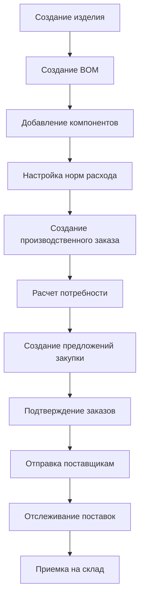
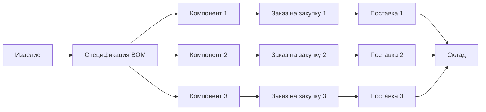
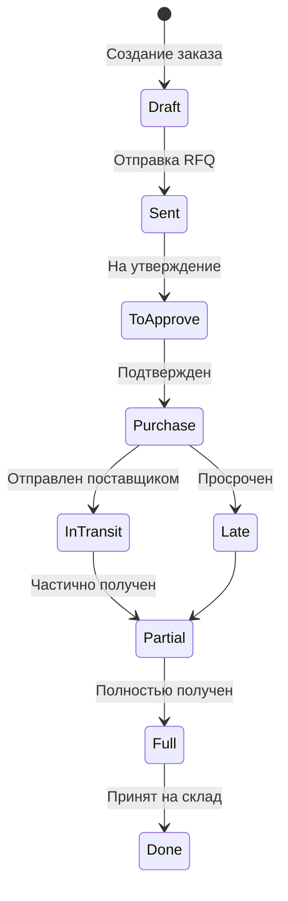

# Инструкция для снабженца: Работа с изделиями, материалами и поставками в Odoo

## Содержание

1. [Введение](#введение)
2. [Создание изделия (Product)](#1-создание-изделия-product)
3. [Создание спецификации (Bill of Materials - BOM)](#2-создание-спецификации-bill-of-materials---bom)
4. [Привязка деталей и материалов к изделию](#3-привязка-деталей-и-материалов-к-изделию)
5. [Отслеживание потребности в материалах](#4-отслеживание-потребности-в-материалах)
6. [Рассылка заказов по категориям](#5-рассылка-заказов-по-категориям)
7. [Отслеживание поставок](#6-отслеживание-поставок)
8. [Практические примеры](#практические-примеры)

---

## Введение

Данная инструкция предназначена для снабженцев, работающих в системе Odoo. Она описывает полный цикл работы: от создания изделия и спецификации до отслеживания поставок материалов.

### Навигация по интерфейсу Odoo

**Главное меню:**
- Расположено в верхней части экрана
- Содержит иконки модулей: Products, Purchase, Manufacturing, Inventory
- При наведении показывается название модуля

**Поиск:**
- Иконка поиска (лупа) в верхней правой части
- Позволяет быстро найти любой модуль, продукт или документ

**Кнопки действий:**
- **Create** (Создать) - создание нового документа
- **Save** (Сохранить) - сохранение изменений
- **Confirm** (Подтвердить) - подтверждение документа
- **Send** (Отправить) - отправка документа
- **Action** (Действие) - дополнительные действия

**Вкладки в формах:**
- В карточках продуктов и документов информация организована по вкладкам
- Основные вкладки: General Information, Inventory, Purchase, Manufacturing, Components

### Общий процесс работы снабженца



### Связь изделия, BOM и закупок



---

## 1. Создание изделия (Product)

### 1.1. Пошаговая инструкция создания продукта

1. **Перейдите в модуль Products**
   - В главном меню выберите **Products → Products**
     - Главное меню находится в верхней части экрана
     - Найдите иконку "Products" (обычно с изображением коробки или товара)
     - Наведите курсор и выберите "Products" из выпадающего меню
   - Или используйте поиск: нажмите на иконку поиска (лупа) в правом верхнем углу и введите "Products"

2. **Создайте новый продукт**
   - Нажмите кнопку **Create** (Создать)
     - Кнопка находится в левом верхнем углу списка продуктов
     - Имеет зеленый цвет и иконку "+"
   - Заполните обязательные поля:
     - **Product Name**: Название изделия (например, "Сборочный узел А-123")
     - **Product Type**: Выберите тип продукта

3. **Выберите тип продукта**
   - **Storable Product** - для изделий, которые хранятся на складе (рекомендуется для производственных изделий)
   - **Consumable** - для расходных материалов
   - **Service** - для услуг

   **Для производственных изделий выбирайте: Storable Product**

### 1.2. Настройка категорий продуктов

1. **На вкладке General Information**
   - **Product Category**: Выберите или создайте категорию
   - Категории помогают группировать продукты для отчетов и фильтрации

2. **Создание новой категории** (если нужно):
   - Нажмите на поле **Product Category**
   - Выберите **Create and Edit**
   - Введите название категории (например, "Сборочные узлы")
   - Сохраните

### 1.3. Настройка маршрутов (Routes)

Маршруты определяют, как продукт будет поступать на склад: через закупку или производство.

1. **Перейдите на вкладку Inventory**

2. **Настройте маршруты:**
   - **Buy** (Закупка) - включите для материалов и комплектующих, которые закупаются
   - **Manufacture** (Производство) - включите для изделий, которые производятся
   - **MTO** (Make To Order) - включите, если изделие производится под заказ

3. **Для производственного изделия:**
   - ✅ Включите **Manufacture**
   - ❌ Отключите **Buy** (если изделие не закупается)

4. **Для материалов и комплектующих:**
   - ✅ Включите **Buy**
   - ❌ Отключите **Manufacture**

### 1.4. Настройка поставщиков по умолчанию

1. **Перейдите на вкладку Purchase**

2. **Добавьте поставщика:**
   - Нажмите **Add a line** в разделе **Vendors**
   - Выберите **Vendor** (поставщика) из списка
   - Если поставщика нет, создайте его:
     - Нажмите **Create and Edit**
     - Заполните название компании
     - Укажите контактную информацию

3. **Настройте параметры поставки:**
   - **Purchase Lead Time**: Срок поставки в днях (например, 14 дней)
   - **Min Quantity**: Минимальное количество для заказа
   - **Price**: Цена за единицу (опционально)

4. **Сохраните изменения**

### 1.5. Настройка единиц измерения

1. **На вкладке General Information**
   - **Unit of Measure**: Выберите единицу измерения
   - Для металла: кг, тонны
   - Для крепежа: шт, упаковки
   - Для жидкостей: литры

2. **Purchase Unit of Measure** (на вкладке Purchase):
   - Единица измерения для закупки (может отличаться от основной)

---

## 2. Создание спецификации (Bill of Materials - BOM)

Спецификация (BOM) определяет, какие компоненты и в каком количестве нужны для производства изделия.

### 2.1. Создание BOM для изделия

1. **Перейдите в модуль Manufacturing**
   - В главном меню: **Manufacturing → Products → Bills of Materials**
   - Или из карточки продукта: вкладка **Manufacturing** → кнопка **Create BoM**

2. **Создайте новую спецификацию**
   - Нажмите **Create**

3. **Заполните основную информацию:**
   - **Product**: Выберите изделие, для которого создается BOM
   - **Quantity**: Количество изделий, на которое рассчитана спецификация (обычно 1)
   - **Unit of Measure**: Единица измерения
   - **BoM Type**: 
     - **Manufacture this product** - для обычных изделий
     - **Kit** - для наборов (комплектов)

4. **Сохраните базовую информацию**

### 2.2. Добавление компонентов и материалов

1. **На вкладке Components** нажмите **Add a line**

2. **Для каждого компонента укажите:**
   - **Component**: Выберите продукт-компонент из списка
   - **Quantity**: Количество на единицу готового изделия
   - **UoM**: Единица измерения
   - **Operation**: Операция производства (если используется маршрутизация)

3. **Пример заполнения:**
   ```
   Component: Металл листовой
   Quantity: 10
   UoM: кг
   
   Component: Болты М8
   Quantity: 20
   UoM: шт
   
   Component: Подшипник
   Quantity: 2
   UoM: шт
   ```

4. **Сохраните спецификацию**

### 2.3. Настройка норм расхода

Норма расхода - это количество материала на единицу готового изделия.

1. **В строке компонента** укажите **Quantity**
   - Это количество материала на единицу изделия
   - Например: для производства 1 изделия нужно 10 кг металла

2. **Учет отходов и потерь:**
   - Если есть отходы, увеличьте количество в BOM
   - Например: если отходы 5%, укажите 10.5 кг вместо 10 кг

3. **Коэффициенты расхода:**
   - Система автоматически умножает количество на количество производимых изделий
   - Для производства 10 изделий: 10 × 10 кг = 100 кг металла

### 2.4. Многоуровневые BOM (подсборки)

Для сложных изделий можно создавать многоуровневые спецификации.

**Пример структуры:**
```
Готовая машина (уровень 0)
├── Сборочный узел (уровень 1, производится)
│   ├── Металл: 50 кг (уровень 2, закупается)
│   └── Крепеж: 100 шт (уровень 2, закупается)
├── Рама (уровень 1, производится)
│   └── Металл: 30 кг (уровень 2, закупается)
└── Электродвигатель (уровень 1, закупается)
```

**Как создать:**
1. Сначала создайте BOM для подсборки (например, "Сборочный узел")
2. Затем создайте BOM для готового изделия и добавьте подсборку как компонент
3. Система автоматически развернет все уровни при расчете потребности

### 2.5. Настройка типов BOM

1. **Normal BOM** (Обычная):
   - Используется для производства
   - Система создает производственные заказы

2. **Phantom BOM** (Kit):
   - Используется для наборов
   - При производстве система разворачивает компоненты напрямую
   - Не создает промежуточные производственные заказы

---

## 3. Привязка деталей и материалов к изделию

### 3.1. Добавление компонентов в BOM

Все компоненты добавляются через BOM (см. раздел 2.2).

### 3.2. Настройка единиц измерения

1. **Для каждого компонента в BOM:**
   - Убедитесь, что единица измерения соответствует реальной
   - Металл: кг, тонны
   - Крепеж: шт
   - Жидкости: литры

2. **Конвертация единиц:**
   - Система автоматически конвертирует единицы измерения
   - Убедитесь, что в системе настроены коэффициенты конвертации

### 3.3. Настройка коэффициентов расхода

1. **В строке компонента BOM:**
   - **Quantity** - это норма расхода на единицу изделия
   - Система автоматически умножает на количество производимых изделий

2. **Пример расчета:**
   - BOM: 10 кг металла на 1 изделие
   - Производственный заказ: 5 изделий
   - Потребность: 10 × 5 = 50 кг металла

### 3.4. Учет отходов и потерь

1. **Включите отходы в норму расхода:**
   - Если отходы 5%, увеличьте количество в BOM на 5%
   - Например: вместо 10 кг укажите 10.5 кг

2. **Или используйте отдельное поле** (если доступно в вашей версии):
   - Некоторые версии Odoo имеют поле для учета отходов
   - Уточните у администратора системы

---

## 4. Отслеживание потребности в материалах

### 4.1. Автоматический расчет потребности при создании производственного заказа

1. **Создайте производственный заказ:**
   - **Manufacturing → Manufacturing Orders → Create**
   - Выберите продукт (изделие)
   - Укажите количество для производства
   - Нажмите **Confirm**

2. **Система автоматически:**
   - Анализирует BOM изделия
   - Проверяет наличие материалов на складе
   - Рассчитывает недостающие материалы
   - Создает предложения закупки (Procurement Proposals)

3. **Просмотр потребности:**
   - В производственном заказе перейдите на вкладку **Components**
   - Увидите список компонентов с количеством:
     - **Reserved**: Зарезервировано на складе
     - **To Consume**: Требуется для производства
     - **Available**: Доступно на складе

### 4.2. Настройка точек заказа (Reorder Points)

Точки заказа автоматически создают предложения закупки при достижении минимального уровня запасов.

1. **Перейдите в настройки:**
   - **Inventory → Configuration → Reordering Rules**
     - Главное меню → иконка "Inventory" (склад)
     - В выпадающем меню выберите "Configuration"
     - Затем "Reordering Rules"
     - Или используйте поиск: введите "Reordering Rules"

2. **Создайте новое правило:**
   - Нажмите **Create**

3. **Заполните параметры:**
   - **Product**: Выберите материал
   - **Min Quantity**: Минимальный уровень запаса (например, 100 кг)
   - **Max Quantity**: Максимальный уровень запаса (например, 500 кг)
   - **Route**: Buy (Закупка)
   - **Trigger**: 
     - **Auto** - автоматическое создание заказа
     - **Manual** - создание предложения для ручного подтверждения
   - **Warehouse**: Выберите склад

4. **Логика работы:**
   - Когда остаток падает ниже Min Quantity, система создает предложение закупки
   - Количество заказа: до Max Quantity

5. **Для материалов с длительным сроком поставки:**
   - **Days to Order**: Укажите количество дней до заказа (например, 30)
   - Система создаст заказ заранее

### 4.3. Просмотр прогноза потребности (Forecast Report)

1. **Перейдите в отчеты:**
   - **Inventory → Reporting → Forecast Report**

2. **Настройте фильтры:**
   - Выберите продукт или категорию
   - Укажите период прогноза
   - Выберите склад

3. **Интерпретация отчета:**
   - **Forecasted Quantity**: Прогнозируемое количество
   - **On Hand**: Текущий остаток
   - **Available**: Доступно с учетом резервирования
   - **Incoming**: Ожидаемые поставки
   - **Outgoing**: Планируемые отгрузки

### 4.4. Мониторинг резервирования материалов

1. **В карточке продукта:**
   - Перейдите на вкладку **Inventory**
   - Раздел **Stock On Hand** показывает:
     - **On Hand**: Общее количество на складе
     - **Reserved**: Зарезервировано для заказов
     - **Available**: Доступно для новых заказов

2. **В производственном заказе:**
   - Вкладка **Components** показывает статус каждого компонента
   - Цветовая индикация:
     - 🟢 Зеленый - достаточно материалов
     - 🟡 Желтый - частично зарезервировано
     - 🔴 Красный - недостаточно материалов

3. **Просмотр резервирований:**
   - **Inventory → Reporting → Stock On Hand**
   - Фильтр по продукту
   - Просмотр детализации резервирований

---

## 5. Рассылка заказов по категориям

### 5.1. Фильтрация заказов по категориям продуктов

1. **Перейдите в заказы на закупку:**
   - **Purchase → Requests for Quotation** или **Purchase Orders**

2. **Используйте фильтры:**
   - Нажмите на иконку фильтра (воронка)
     - Иконка находится над списком заказов, слева от поиска
     - Имеет вид воронки или фильтра
   - Выберите **Product Category**
     - В выпадающем списке фильтров найдите "Product Category"
     - Или начните вводить "Category" для поиска
   - Выберите нужную категорию
     - Появится список доступных категорий
     - Можно выбрать несколько категорий (Ctrl+клик)

3. **Группировка по категориям:**
   - Нажмите на иконку группировки
   - Выберите **Product Category**
   - Заказы будут сгруппированы по категориям

### 5.2. Группировка заказов по поставщикам

1. **В списке заказов:**
   - Нажмите на иконку группировки
   - Выберите **Vendor**
   - Заказы будут сгруппированы по поставщикам

2. **Массовая отправка одному поставщику:**
   - Отфильтруйте заказы по поставщику
   - Выделите нужные заказы (чекбоксы)
   - Используйте действие **Send by Email** (если доступно)

### 5.3. Массовая отправка RFQ/PO

1. **Выделите несколько заказов:**
   - В списке заказов отметьте чекбоксы нужных заказов
     - Чекбоксы находятся в первой колонке списка
     - Можно выделить все заказы на странице (чекбокс в заголовке)
   - Или используйте фильтры для выбора группы заказов
     - Примените фильтры (по категории, поставщику, статусу)
     - Все отфильтрованные заказы можно выделить массово

2. **Отправка:**
   - Нажмите **Action** (Действие)
     - Кнопка находится над списком заказов
     - Становится активной при выделении одного или нескольких заказов
   - Выберите **Send RFQ by Email** или **Send PO by Email**
     - В выпадающем меню найдите нужное действие
     - RFQ - для запросов предложений (черновики)
     - PO - для подтвержденных заказов
   - Система отправит заказы соответствующим поставщикам
     - Откроется форма отправки email
     - Проверьте получателей и содержимое
     - Нажмите "Send"

3. **Проверка статусов:**
   - После отправки статус заказа изменится на **RFQ Sent** или **PO Sent**
   - В истории заказа будет запись об отправке

### 5.4. Использование Purchase Agreements для категорий

Purchase Agreements (Соглашения о закупке) позволяют создавать рамочные соглашения с поставщиками.

1. **Создайте соглашение:**
   - **Purchase → Purchase Agreements → Create**
   - Выберите тип: **Blanket Order**
   - Укажите поставщика
   - Укажите период действия

2. **Добавьте продукты:**
   - На вкладке **Products** добавьте продукты категории
   - Укажите цены и условия

3. **Использование соглашения:**
   - При создании заказа выберите соглашение
   - Система автоматически применит условия соглашения

---

## 6. Отслеживание поставок

### 6.1. Процесс отслеживания поставок



### 6.2. Мониторинг статусов заказов на закупку

1. **Просмотр списка заказов:**
   - **Purchase → Purchase Orders**
     - Главное меню → иконка "Purchase" (покупка/закупка)
     - Выберите "Purchase Orders" или "Requests for Quotation"
     - Список отображается в виде таблицы с колонками: Order, Vendor, Date, Status, Amount
   - Статусы заказов:
     - **Draft (RFQ)** - черновик запроса предложения
     - **Sent** - отправлен поставщику
     - **To Approve** - на утверждении
     - **Purchase Order** - подтвержден, ожидает поставки
     - **Done** - получен и принят
     - **Cancel** - отменен

2. **Цветовая индикация:**
   - 🟢 Зеленый - все в порядке
   - 🟡 Желтый - требует внимания
   - 🔴 Красный - просрочен или проблема

3. **Фильтры по статусам:**
   - Используйте предустановленные фильтры:
     - **Late Receipts** - просроченные поставки
     - **Not Acknowledged** - не подтвержденные поставщиком
     - **To Approve** - на утверждении

### 6.3. Отслеживание входящих поставок (Stock Pickings)

1. **Просмотр поставок:**
   - В заказе на закупку нажмите на количество входящих поставок
     - Откройте заказ на закупку
     - В верхней части формы найдите поле "Incoming Shipment" с числом
     - Нажмите на это число - откроется список поставок
   - Или перейдите: **Inventory → Transfers → Incoming Shipments**
     - Главное меню → Inventory → Transfers
     - Выберите "Incoming Shipments" (Входящие поставки)

2. **Статусы поставки:**
   - **Draft** - создана, не подтверждена
   - **Waiting** - ожидает обработки
   - **Ready** - готова к приемке
   - **Done** - принята на склад
   - **Cancel** - отменена

3. **Детали поставки:**
   - **Scheduled Date**: Планируемая дата поставки
   - **Source Document**: Связанный заказ на закупку
   - **Products**: Список товаров в поставке

### 6.4. Контроль сроков поставки

1. **В заказе на закупку:**
   - **Expected Arrival**: Ожидаемая дата прибытия
   - **Receipt Status**: Статус получения
     - **Pending** - не получен
     - **Partial** - частично получен
     - **Full** - полностью получен

2. **Просмотр просроченных поставок:**
   - Фильтр: **Late Receipts**
   - Или в отчете: **Purchase → Reporting → Vendor Delay Report**

3. **Настройка напоминаний:**
   - **Settings → Purchase → Receipt Reminder**
   - Включите автоматические напоминания поставщикам

### 6.5. Отчеты о задержках поставок

1. **Vendor Delay Report:**
   - **Purchase → Reporting → Vendor Delay Report**
   - Показывает задержки по поставщикам
   - Анализ причин задержек

2. **Purchase Analysis:**
   - **Purchase → Reporting → Purchase Analysis**
   - Фильтры:
     - По поставщикам
     - По продуктам
     - По периодам
     - По статусам

3. **Настройка дашборда:**
   - **Purchase → Dashboard**
   - Добавьте виджеты:
     - Текущие заказы
     - Задержки поставок
     - Заказы на утверждение
     - Аналитика по поставщикам

---

## Практические примеры

### Пример 1: Создание простого изделия с BOM

**Задача:** Создать изделие "Сборочный узел А-123" с компонентами: металл 10 кг, болты 20 шт, подшипник 2 шт.

**Шаги:**

1. **Создайте изделие:**
   - Products → Products → Create
   - Name: "Сборочный узел А-123"
   - Type: Storable Product
   - Category: "Сборочные узлы"
   - Inventory → Routes: ✅ Manufacture

2. **Создайте материалы (если еще не созданы):**
   - Металл листовой: Type: Storable, Route: Buy
   - Болты М8: Type: Storable, Route: Buy
   - Подшипник: Type: Storable, Route: Buy

3. **Создайте BOM:**
   - Manufacturing → Bills of Materials → Create
   - Product: "Сборочный узел А-123"
   - Quantity: 1
   - Components:
     - Металл листовой: 10 кг
     - Болты М8: 20 шт
     - Подшипник: 2 шт

4. **Настройте поставщиков для материалов:**
   - Для каждого материала на вкладке Purchase укажите поставщика и срок поставки

### Пример 2: Отслеживание потребности при производственном заказе

**Задача:** Произвести 5 единиц "Сборочного узла А-123" и отследить потребность в материалах.

**Шаги:**

1. **Создайте производственный заказ:**
   - Manufacturing → Manufacturing Orders → Create
   - Product: "Сборочный узел А-123"
   - Quantity: 5
   - Confirm

2. **Проверьте потребность:**
   - В производственном заказе → вкладка Components
   - Увидите:
     - Металл: требуется 50 кг (10 × 5)
     - Болты: требуется 100 шт (20 × 5)
     - Подшипник: требуется 10 шт (2 × 5)

3. **Проверьте наличие:**
   - Если материалов недостаточно, система создаст предложения закупки
   - Purchase → Requests for Quotation → проверьте предложения

4. **Создайте заказы на закупку:**
   - Выберите предложения
   - Нажмите Create Purchase Order
   - Подтвердите и отправьте поставщикам

### Пример 3: Массовая рассылка заказов по категориям

**Задача:** Отправить все заказы на металл одному поставщику.

**Шаги:**

1. **Отфильтруйте заказы:**
   - Purchase → Purchase Orders
   - Фильтр: Product Category = "Металл"
   - Фильтр: Vendor = "Поставщик металла"

2. **Выделите заказы:**
   - Отметьте чекбоксы нужных заказов

3. **Отправьте:**
   - Action → Send PO by Email
   - Или откройте каждый заказ и нажмите Send

### Пример 4: Отслеживание просроченных поставок

**Задача:** Найти и обработать все просроченные поставки.

**Шаги:**

1. **Найдите просроченные поставки:**
   - Purchase → Purchase Orders
   - Фильтр: Late Receipts

2. **Проверьте детали:**
   - Откройте каждый заказ
   - Проверьте Expected Arrival
   - Проверьте Receipt Status

3. **Свяжитесь с поставщиками:**
   - Используйте кнопку Send Reminder
   - Или свяжитесь напрямую

4. **Обновите даты (если нужно):**
   - Если поставщик сообщил новую дату, обновите Expected Arrival

---

## Полезные советы

1. **Всегда указывайте поставщиков по умолчанию** для закупаемых материалов - это ускорит создание заказов

2. **Настройте реалистичные сроки поставки** - это поможет системе правильно планировать закупки

3. **Используйте точки заказа** для критичных материалов - система будет автоматически создавать предложения закупки

4. **Регулярно проверяйте предложения закупки** перед подтверждением - это позволит оптимизировать объемы и сроки

5. **Мониторьте связь** между производственными заказами и заказами на закупку - это поможет отслеживать выполнение планов

6. **Используйте категории продуктов** для группировки и фильтрации - это упростит работу с большим количеством материалов

7. **Настройте дашборд** под свои задачи - добавьте виджеты для быстрого доступа к важной информации

---

## Дополнительные ресурсы

- [Руководство по настройке закупок](./PURCHASE_SETUP_GUIDE.md)
- [Интеграция закупок с производством](./examples/mrp_integration_setup.md)
- [Настройка правил автоматической закупки](./examples/procurement_rules_setup.md)
- [Официальная документация Odoo](https://www.odoo.com/documentation)

---

*Последнее обновление: 2024*
